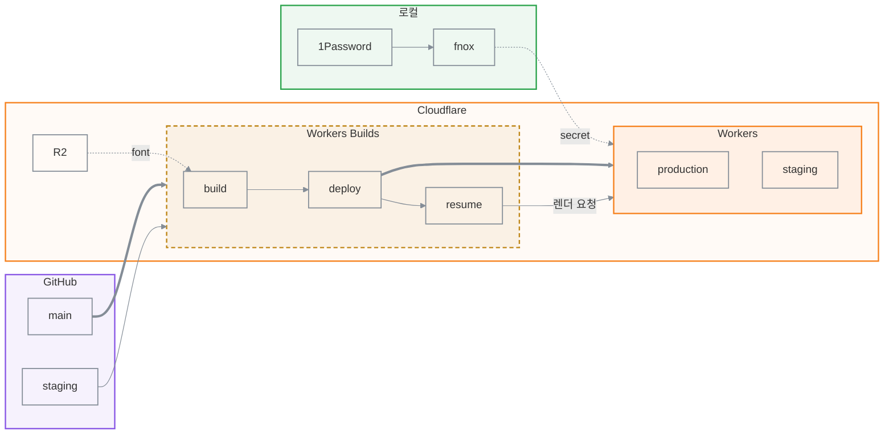
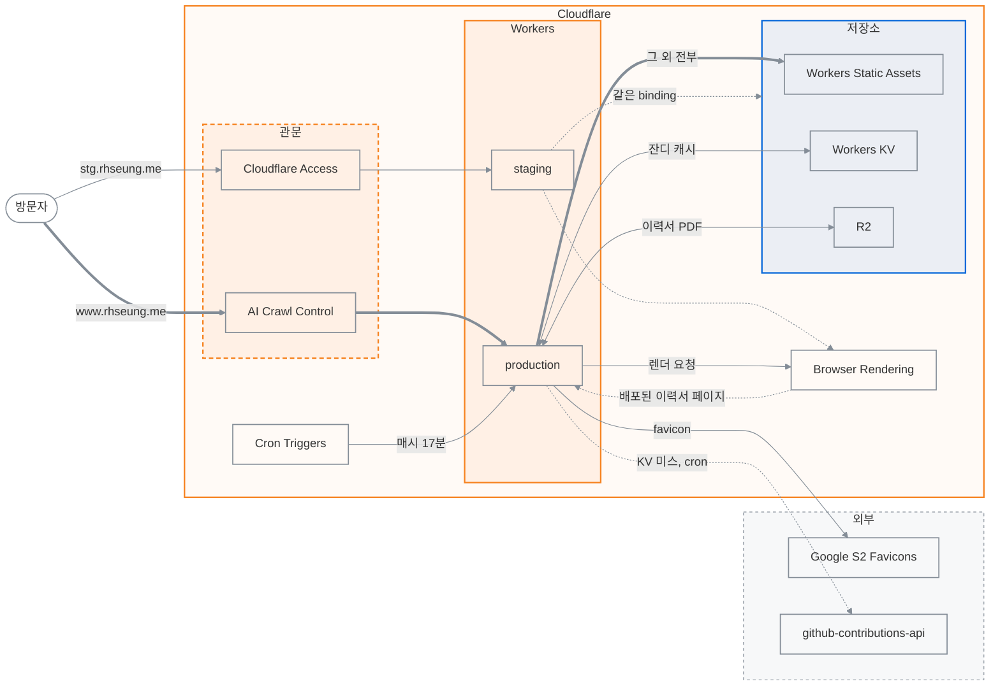

# rhseung.me

개인 사이트다. Astro가 모든 페이지를 빌드 타임에 HTML로 미리 만들고, React island는
상호작용이 필요한 자리에만 올라간다. Cloudflare Workers에 배포하지만 **페이지는 여전히 정적
자산**이고, worker는 그 앞에서 API 네 개를 처리한다.

이 파일에는 전체 그림과 읽을 곳만 담는다. 규칙과 세부 사항은 아래 문서에 있다.

## 인프라

### 배포

`main`과 `staging`이 각자의 worker로 간다. 빌드는 R2에서 font를 읽고, 배포가 끝난 뒤
`resume` task가 worker를 다시 쳐서 이력서 PDF를 굽는다.

### 요청 처리

방문자는 관문을 지나 worker로 들어온다. 페이지는 정적 자산에서 그대로 나가고, `/api/*`만
binding이나 외부로 나간다. **binding을 읽고 쓰는 것은 worker뿐이다.** cron도 KV를 직접
건드리지 않고 worker의 `scheduled` 핸들러를 깨우며, Browser Rendering은 PDF를 돌려줄 뿐
R2에 넣는 것은 worker다. 이력서를 구울 때 Browser Rendering이 배포된 페이지를 여느라 요청이
worker로 한 바퀴 돌아온다. staging은 production과 같은 binding을 쓴다. 어느 route가 무엇을
부르는지는 `docs/deploy.md`의 표에 있다.

## 참고 문서

| 내용                       | 위치                 |
| -------------------------- | -------------------- |
| 코드 구조와 지켜야 할 규칙 | `AGENTS.md`          |
| 배포, 환경, secret, 함정   | `docs/deploy.md`     |
| 파일을 두는 자리           | `docs/registries.md` |

## 유의 사항

- **페이지를 SSR로 내지 않는다.** worker는 `/api/*`와 `/resume-*.pdf`만 처리하고 나머지는
  `env.ASSETS.fetch()`로 넘긴다. 자산에 없는 경로에만 worker가 404를 만든다.
- **환경은 두 가지가 가른다.** `wrangler.jsonc`의 `env.staging`이 어느 worker와 도메인에
  올릴지를 정하고, 빌드 때 들어가는 `SITE_ENV`가 WIP gate를 켤지를 정한다.
- **staging은 Cloudflare Access 뒤에 있다.** application의 정책이 host가 아니라 worker에
  붙어 있어서 경로로 우회할 수 없다. 배포 task도 service token을 함께 보낸다.
- **production은 AI crawler를 막는다.** `robots.txt`가 학습용 crawler에게 의사를 밝히고,
  실제 차단은 AI Crawl Control이 맡는다. 검색 crawler와 AI assistant는 통과시킨다.
- **이력서 PDF는 빌드가 아니라 배포 뒤에 나온다.** worker가 배포된 `/{lang}/resume/`를
  Browser Rendering으로 열어 R2에 저장한다. 로컬에서는 그 링크가 404다.
- **README.md는 이 프로젝트 문서가 아니다.** 이 저장소가 GitHub 프로필 저장소라
  README는 프로필 페이지 역할을 한다.
