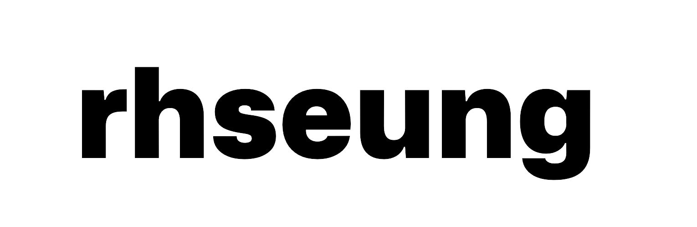

  <picture>
      <source media="(prefers-color-scheme: dark)" srcset="images/logo_dark.png">
      <source media="(prefers-color-scheme: light)" srcset="images/logo_light.png">
      
  </picture>

## `👌`

#### Languages

  
  
    
  
  
    
  
  
  
  
    
  
  
  
  

#### Framework & Libraries

  
    
  
  
    
  
  
  
  

#### Tools

  
  
    
  
  
    
  
  
  

## `📫`

  
