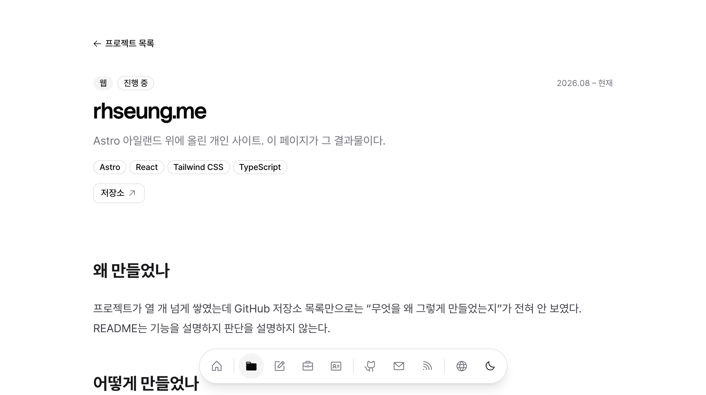

블로그를 새로 깔면 제일 먼저 하는 일이 이거다. 글 하나를 만들어서 쓸 수 있는 걸 전부 넣어보고,
뭐가 깨지는지 본다. 깨진 건 대개 스타일 하나가 빠졌거나 플러그인이 안 붙은 거다.

# 제목 1

## 제목 2

### 제목 3

#### 제목 4

##### 제목 5

###### 제목 6

### 제목에 `코드`와 [링크](/ko/blog/)를 넣으면

앵커가 어떻게 잡히는지도 같이 본다.

## 문단과 줄바꿈

문단은 빈 줄로 나뉜다. 이 문장은 위 문단과 별개다.

한 문단 안에서 줄을 끊으려면 역슬래시를 쓴다.\
이 줄은 같은 문단의 새 줄이다.

이스케이프도 된다 -- \*별표는 별표로\*, \_밑줄은 밑줄로\_, \`백틱은 백틱으로\`.

## 인라인 서식

**굵게**, _기울임_, **_굵은 기울임_**, ~~취소선~~, `인라인 코드`,
그리고 백틱이 든 코드 `` `이렇게` ``.

HTML 도 그대로 산다 -- H<sub>2</sub>O, x<sup>2</sup>, <mark>형광펜</mark>,

<abbr title="Cascading Style Sheets">CSS</abbr>, <kbd>Ctrl</kbd>.

이모지도 나온다 🎉 🇰🇷 👨‍💻

## 링크

- 인라인 링크: [글 목록](/ko/blog/)
- 제목 달린 링크: [프로젝트](/ko/projects/ '마우스를 올리면 뜬다')
- 참조식 링크: [Astro][astro] 와 [같은 참조를 두 번][astro]
- 그냥 URL: https://astro.build
- 꺾쇠 자동 링크는 MDX 에서 못 쓴다 -- `<` 를 JSX 로 읽는다. `[텍스트](주소)` 로 적는다.
- 같은 글 안 앵커: [목록으로](#목록)

[astro]: https://astro.build 'Astro 공식 사이트'

## 목록

### 순서 없는 목록

- 첫 항목
- 중첩도 된다
  - 두 번째 깊이
    - 세 번째 깊이
- `코드`와 **서식**이 든 항목

### 순서 있는 목록

1. 첫 항목
2. 두 번째
   1. 중첩된 번호
   2. 축이 흐트러지지 않아야 한다
3. 세 번째

5부터 시작하는 목록도 있다.

5. 다섯
6. 여섯
7. 일곱

### 느슨한 목록

- 항목 사이에 빈 줄이 있으면 각 항목이 문단이 된다.

- 그래서 이 항목은 위 항목과 간격이 넓다.

- 세 번째 항목.

### 항목 안에 블록 넣기

1. 코드 블록을 품은 항목

   ```sh
   bun run dev
   ```

2. 인용을 품은 항목

   > 목록 안에서도 인용은 인용이다.

3. 표를 품은 항목

   | 키  | 값  |
   | --- | --- |
   | a   | 1   |

### 체크박스

- [x] 끝낸 일
- [ ] 안 끝낸 일
- [ ] 체크박스가 글머리와 같은 축에 서는지

## 인용

> 좋은 코드는 아예 쓰지 않은 코드다.
>
> > 인용 안의 인용.
>
> 인용 안에서도 **서식**과 `코드`가 살고, 목록도 들어간다.
>
> - 첫 항목
> - 두 번째 항목
>
> ```ts
> const quoted = true;
> ```

## 코드

### 인라인

인라인은 `const x = 1` 처럼.

### 언어를 적은 블록

```ts
type Shortcut = readonly string[];

export function press(keys: Shortcut): string {
  return keys.map((key) => key.toUpperCase()).join(' + ');
}
```

```sh
bun run dev
```

```diff
- const old = '지운 줄';
+ const next = '더한 줄';
```

### 언어를 안 적은 블록

```
plain text
  들여쓰기가 그대로 남는다
```

### 가로로 긴 블록

가로로 긴 줄은 블록 안에서 스크롤돼야 한다.

```ts
export const wide = {
  alpha: 1,
  bravo: 2,
  charlie: 3,
  delta: 4,
  echo: 5,
  foxtrot: 6,
  golf: 7,
  hotel: 8,
  india: 9,
};
```

## 표

### 기본

| 컬렉션     | 원본                  | 언어 처리        |
| ---------- | --------------------- | ---------------- |
| `posts`    | `content/posts/*.mdx` | frontmatter lang |
| `projects` | `content/projects/**` | 디렉토리로 분리  |

### 정렬

| 왼쪽   |  가운데   |    오른쪽 |
| :----- | :-------: | --------: |
| left   |  center   |     right |
| 짧게   | 조금 길게 | 아주 길게 |
| `code` | **굵게**  |  _기울임_ |

### 가로로 긴 표

| 키     | 맥                                        | 윈도우                                              | 리눅스                                              | 비고      | 추가 | 더  | 또  | 계속 |
| ------ | ----------------------------------------- | --------------------------------------------------- | --------------------------------------------------- | --------- | ---- | --- | --- | ---- |
| 팔레트 | <Shortcut keys={['cmd', 'shift', 'p']} /> | <Shortcut os="win" keys={['ctrl', 'shift', 'p']} /> | <Shortcut os="win" keys={['ctrl', 'shift', 'p']} /> | 전부 같다 | a    | b   | c   | d    |
| 저장   | <Shortcut keys={['cmd', 's']} />          | <Shortcut os="win" keys={['ctrl', 's']} />          | <Shortcut os="win" keys={['ctrl', 's']} />          | 습관      | e    | f   | g   | h    |

## 단축키

<Shortcut keys={['cmd', 'shift', 'p']} /> 하나면 나머지는 거기서 다 찾을 수 있다. 취소는
<Shortcut keys={['esc']} />, 확정은 <Shortcut keys={['enter']} />.

## 수식

### 문장 안에서

문장 안에 $E = mc^2$ 처럼 넣는다.

### 따로 떼서

$$
\int_{-\infty}^{\infty} e^{-x^2}\,dx = \sqrt{\pi}
$$

### 여러 줄 정렬

$$
\begin{aligned}
f(x) &= (x+1)^2 \\
     &= x^2 + 2x + 1
\end{aligned}
$$

## 이미지

### 그대로 넣기



### 링크로 감싸기

제목을 달고 링크로 감싼 이미지.

[](/ko/projects/)

### 캡션 달기

<Figure caption="JS 를 끈 브라우저로 본 프로젝트 상세 - 본문이 그대로 읽힌다">


</Figure>

### 비율별

원격 이미지는 `astro:assets` 최적화를 안 탄다 - 아래 넷은 picsum 이 주는 그대로다.
화면 폭을 줄여가며 어디서 깨지는지 보라고 넣어뒀다.

앞의 셋은 본문보다 커서 폭에 맞춰 줄어들고, 뒤의 넷은 원본이 작아 그 크기 그대로 선다.


---

## MDX

### 중괄호 표현식

중괄호는 표현식이다 -- 2 + 2 는 {2 + 2}, 오늘 연도는 {new Date().getFullYear()}.
글자로 쓰려면 이스케이프한다 \{ 이렇게 \}.

### Callout

<Callout tone="note" title="참고">

`Callout` 은 문단 흐름을 끊고 하나를 강조한다. 안에서도 목록과 `코드`가 그대로 산다.

- 첫 항목
- 두 번째 항목

</Callout>

<Callout tone="tip" title="팁">

<Shortcut keys={['caps']} /> 를 <Shortcut keys={['ctrl']} /> 로 바꾸면 새끼손가락이 산다.

</Callout>

<Callout tone="warn" title="주의">

<Shortcut keys={['cmd', 'q']} /> 와 <Shortcut keys={['cmd', 'w']} /> 는 한 칸 차이다.

</Callout>

### Stats

<Stats>
  <Stat value="23" label="매핑된 키" />
  <Stat value="0px" label="정렬 편차" />
  <Stat value="5" label="스토리" />
</Stats>

### Steps

<Steps>

<Step index={1} title="글을 만든다">

`src/content/posts/<slug>/index.mdx` 하나면 라우트가 생긴다.

</Step>

<Step index={2} title="문법을 넣는다">

표, 수식, 각주, 체크박스까지 한 번에 확인한다.

</Step>

<Step index={3} title="깨진 걸 고친다">

대개 `prose` 스타일 하나가 빠져 있다.

</Step>

</Steps>

### Detail

<Detail summary="전체 키 목록">

<Shortcut keys={['cmd']} /> <Shortcut keys={['opt']} /> <Shortcut keys={['ctrl']} />
<Shortcut keys={['shift']} /> <Shortcut keys={['caps']} /> <Shortcut keys={['fn']} />
<Shortcut keys={['enter']} /> <Shortcut keys={['tab']} /> <Shortcut keys={['backtab']} />
<Shortcut keys={['backspace']} /> <Shortcut keys={['del']} /> <Shortcut keys={['esc']} />
<Shortcut keys={['space']} /> <Shortcut keys={['up']} /> <Shortcut keys={['down']} />
<Shortcut keys={['left']} /> <Shortcut keys={['right']} /> <Shortcut keys={['pageup']} />
<Shortcut keys={['pagedown']} /> <Shortcut keys={['home']} /> <Shortcut keys={['end']} />
<Shortcut keys={['eject']} /> <Shortcut keys={['win']} />

</Detail>

## 구분선

세 개 이상의 하이픈이 한 줄에 있으면 구분선이다. 위 이미지와 MDX 사이에도 하나 있다.

---

## 각주

각주는 이렇게 달고[^1], 여러 개도 된다[^2]. 본문 순서와 상관없이 아래에 모인다.

여기까지 멀쩡하면 글을 써도 된다.

[^1]: 첫 각주. 안에서도 `코드`와 [링크](/ko/blog/)가 산다.

[^2]: 둘째 각주.
